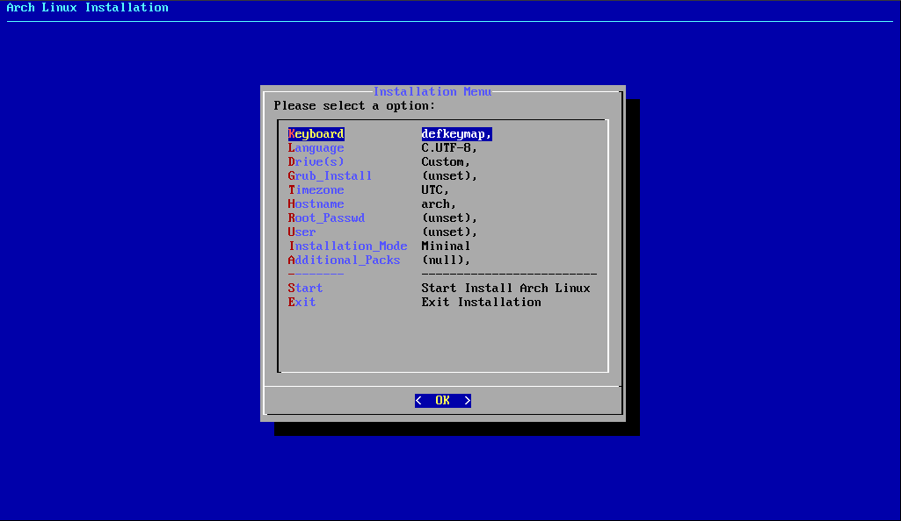

# Easy 2 Install Arch Linux 

----

<p align=center></p>

<p align=center>Based on a simulated GUI dialog (Dialog), configure and install Arch Linux.</p>

## Installation

1. Use git to clone this repository.
   ```bash
   git clone https://github.com/KateL2002/Easy-2-Install-Arch-Linux.git
   ```

2. Change work directory and run this script.
   ```bash
   cd Easy-2-Install-Arch-Linux
   bash setup.sh
   ```

3. Setup the installation. 

## Installation Mode Instruction

### Important Packages

- base
- base-devel
- linux-lts
- linux-lts-headers
- linux-firmware
- nano
- man-pages
- man-db
- grub
- networkmanager
- zsh
- zsh-completions
- neofetch
- Firefox (If select desktop or server installation mode)

### Desktop Environment

#### 1. Budgie

- budgie
- nemo
- cinnamon-translations
- lightdm
- lightdm-slick-greeter
- arc-gtk-theme
- papirus-icon-theme
- network-manager-applet

#### 2. Cinnamon

- cinnamon
- cinnamon-translations
- xed
- xreader
- metacity
- gnome-terminal
- gnome-themes-extra
- system-config-printer
- gnome-keyring
- blueberry
- touchegg
- lightdm
- lightdm-slick-greeter
- arc-gtk-theme
- papirus-icon-theme

#### 3. Deepin

- deepin
- deepin-extra
- lightdm

#### 4. GNOME

- gnome
- gnome-extra 
- gnome-shell
- gdm

#### 5. Plasma

- plasma
- plasma-wayland-session
- sddm-kcm
- konsole
- dolphin

#### 6. LXDE

- lxde (Only for groups)

#### 7. LXQT

- xorg-server
- lxqt
- xscreensaver
- libstatgrab
- libsysstat
- breeze-icons
- oxygen-icons
- sddm

#### 8. Mate

- mate
- mate-extra
- mate-applet-dock
- mate-media
- blueman
- network-manager-applet
- mate-power-manager
- system-config-printer
- lightdm lightdm-slick-greeter

#### 9. Xfce

- xfce4
- xfce4-goodies
- xfce4-pulseaudio-plugin
- libcanberra
- pulseaudio
- pulseaudio-alsa
- pulseaudio-bluetooth
- pulseaudio-jack
- sound-theme-freedesktop
- xfce4-pulseaudio-plugin
- xfce4-session
- xscreensaver
- lightdm
- lightdm-gtk-greeter
